# System Architecture Diagram

This diagram shows the overall 4-phase agent workflow of the sponsor-finder system.

```mermaid
flowchart TB
    User[User Input:<br/>Search Prompt] --> Phase1

    subgraph Phase1[Phase 1: Keyword Extraction]
        KE[keyword-extractor agent<br/>Claude Haiku 4.5]
        Mission[CSOAF Mission Context]
        Mission --> KE
    end

    Phase1 --> KWOutput[Keywords JSON:<br/>- Primary keywords<br/>- Secondary keywords<br/>- Location<br/>- Sector<br/>- Grant size]

    KWOutput --> Phase2

    subgraph Phase2[Phase 2: Web Research]
        WR[web-researcher agent<br/>Claude Haiku 4.5]
        WebSearch[Web Search & Crawl]
        WR --> WebSearch
    end

    Phase2 --> SponsorList[Raw Sponsor List:<br/>15-25 prospects<br/>with relevance scores]

    SponsorList --> Phase3

    subgraph Phase3[Phase 3: Categorization]
        Cat[categorizer agent<br/>Claude Haiku 4.5]
        TypeSort[Sort by Type:<br/>Foundation/Corp/NGO/Gov]
        Cat --> TypeSort
    end

    Phase3 --> CatList[Categorized Sponsors:<br/>Organized by type<br/>with metadata]

    CatList --> Phase4

    subgraph Phase4[Phase 4: Validation]
        Val[validator agent<br/>Claude Sonnet 4.5]
        Quality[Quality Scoring<br/>Giving Program Check]
        Val --> Quality
    end

    Phase4 --> Output[Validated Output:<br/>Quality score ≥5<br/>20+ sponsors]

    Output --> Reports

    subgraph Reports[Output Formats]
        MD[Markdown Report]
        CSV[CSV Export]
        JSON[JSON Data]
    end

    Reports --> Docs[docs/ directory]

    style Phase1 fill:#e1f5ff
    style Phase2 fill:#fff4e1
    style Phase3 fill:#f0e1ff
    style Phase4 fill:#e1ffe1
    style Reports fill:#ffe1e1
```

## Key Components

### Agent Pipeline
- **Phase 1**: Extracts structured keywords from natural language prompts
- **Phase 2**: Searches web for sponsor prospects using keywords
- **Phase 3**: Organizes sponsors by type for better analysis
- **Phase 4**: Validates quality and filters low-quality results

### Model Selection
- **Haiku 4.5**: Used for Phases 1-3 (speed and efficiency)
- **Sonnet 4.5**: Used for Phase 4 (quality validation requires deeper analysis)

### Data Flow
Each phase outputs structured data that becomes input for the next phase, creating a progressive refinement pipeline.
