# Data Flow Diagram

This diagram shows how data transforms as it flows through the sponsor-finder system.

```mermaid
flowchart LR
    subgraph Input
        UP[User Prompt:<br/>'Find NYC arts education<br/>sponsors for disability<br/>programs with $50k+ grants']
    end

    subgraph Transform1[Phase 1 Transform]
        direction TB
        T1A[Parse prompt] --> T1B[Extract entities]
        T1B --> T1C[Add mission context]
        T1C --> T1D[Structure keywords]
    end

    Input --> Transform1

    Transform1 --> Data1

    subgraph Data1[Keywords JSON]
        direction TB
        D1A["primary: ['arts education',<br/>'disability services']"]
        D1B["location: ['NYC', 'New York']"]
        D1C["grant_size: '$50k+'"]
    end

    Data1 --> Transform2

    subgraph Transform2[Phase 2 Transform]
        direction TB
        T2A[Build search queries] --> T2B[Web search]
        T2B --> T2C[Crawl sponsor sites]
        T2C --> T2D[Extract contact info]
        T2D --> T2E[Score relevance]
    end

    Transform2 --> Data2

    subgraph Data2[Raw Sponsors Array]
        direction TB
        D2A["Sponsor 1:<br/>name, website, mission,<br/>relevance: 8.5"]
        D2B["Sponsor 2:<br/>name, website, mission,<br/>relevance: 7.2"]
        D2C["...15-25 total"]
    end

    Data2 --> Transform3

    subgraph Transform3[Phase 3 Transform]
        direction TB
        T3A[Analyze sponsor type] --> T3B[Group by category]
        T3B --> T3C[Enrich metadata]
    end

    Transform3 --> Data3

    subgraph Data3[Categorized Object]
        direction TB
        D3A["foundations: [...]"]
        D3B["corporations: [...]"]
        D3C["ngos: [...]"]
        D3D["government: [...]"]
    end

    Data3 --> Transform4

    subgraph Transform4[Phase 4 Transform]
        direction TB
        T4A[Verify legitimacy] --> T4B[Check giving programs]
        T4B --> T4C[Score quality 1-10]
        T4C --> T4D[Filter score < 5]
        T4D --> T4E[Rank by match]
    end

    Transform4 --> Data4

    subgraph Data4[Final Output]
        direction TB
        D4A["20+ validated sponsors"]
        D4B["Quality scores ≥5"]
        D4C["Contact info verified"]
        D4D["Mission alignment confirmed"]
    end

    Data4 --> Output

    subgraph Output[Formatted Reports]
        OUT1[Markdown Report]
        OUT2[CSV Spreadsheet]
        OUT3[JSON Data File]
    end

    style Input fill:#e8f4f8
    style Transform1 fill:#fff9e6
    style Data1 fill:#e6f3ff
    style Transform2 fill:#fff9e6
    style Data2 fill:#e6f3ff
    style Transform3 fill:#fff9e6
    style Data3 fill:#e6f3ff
    style Transform4 fill:#fff9e6
    style Data4 fill:#e6ffe6
    style Output fill:#ffe6e6
```

## Data Transformation Stages

### Stage 1: Natural Language → Structured Keywords
- Input: Free-form user prompt
- Transform: NLP extraction + mission context enrichment
- Output: JSON with categorized keywords

### Stage 2: Keywords → Sponsor Prospects
- Input: Structured search terms
- Transform: Web research + content extraction + relevance scoring
- Output: Array of sponsor objects with metadata

### Stage 3: Flat List → Categorized Groups
- Input: Unsorted sponsor array
- Transform: Type classification + grouping
- Output: Structured object with sponsors organized by type

### Stage 4: Raw Data → Validated Results
- Input: Categorized sponsors (unverified)
- Transform: Legitimacy checks + quality scoring + filtering
- Output: High-quality sponsor list ready for outreach

### Stage 5: Structured Data → User-Friendly Formats
- Input: Validated JSON data
- Transform: Format conversion (Markdown/CSV/JSON)
- Output: Multiple report formats in docs/ directory
