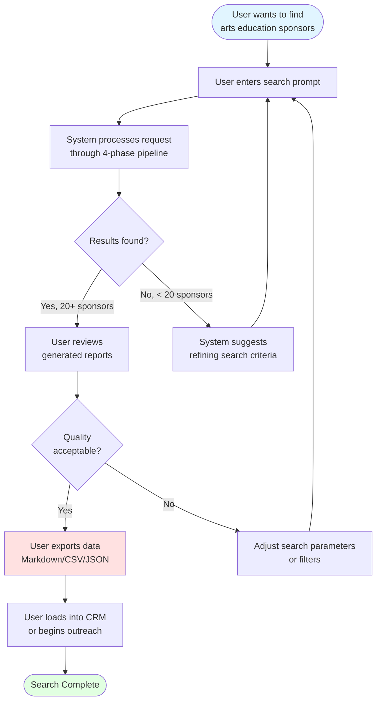
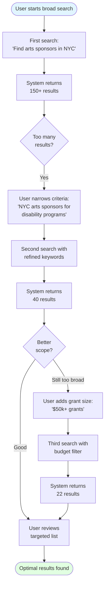
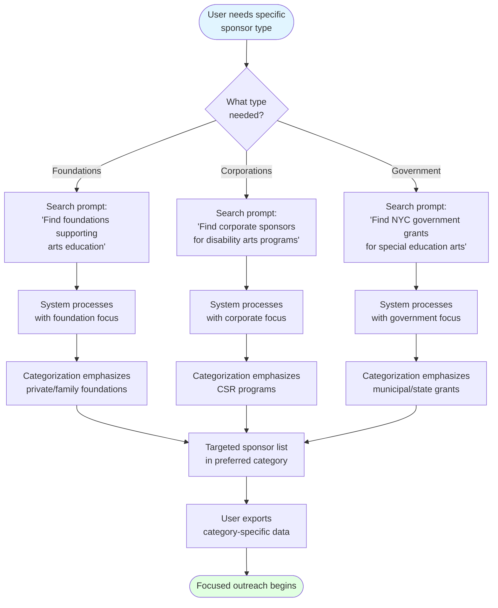
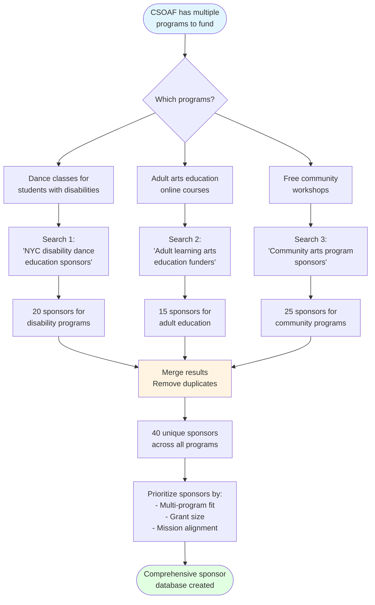

# User Scenario Flowcharts

This document shows different user journeys through the sponsor-finder system.

## Scenario 1: Basic Search Flow

## Scenario 2: Iterative Refinement

## Scenario 3: Category-Specific Search

## Scenario 4: Multi-Program Search

## Common User Paths

### Quick Search (Power User)
1. Enter detailed prompt with all criteria
2. Review results
3. Export to CSV
4. Load into Salesforce

### Exploratory Search (New User)
1. Start with broad prompt
2. Review initial results
3. Refine based on categories found
4. Iterate until optimal scope
5. Export final list

### Targeted Campaign
1. Specify sponsor type + program + location
2. Review high-quality matches
3. Export with contact info
4. Begin personalized outreach

### Research Mode
1. Run multiple searches for different programs
2. Compare sponsor types across searches
3. Identify overlapping prospects
4. Build comprehensive sponsor database
