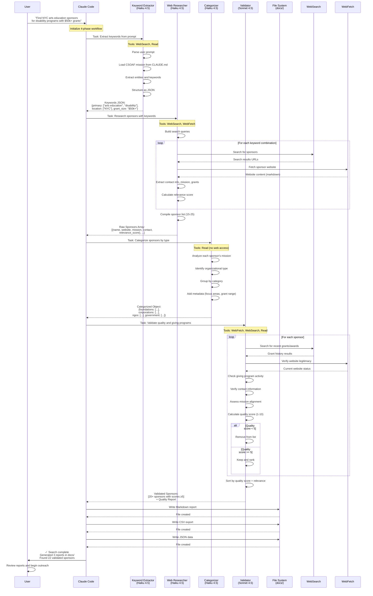
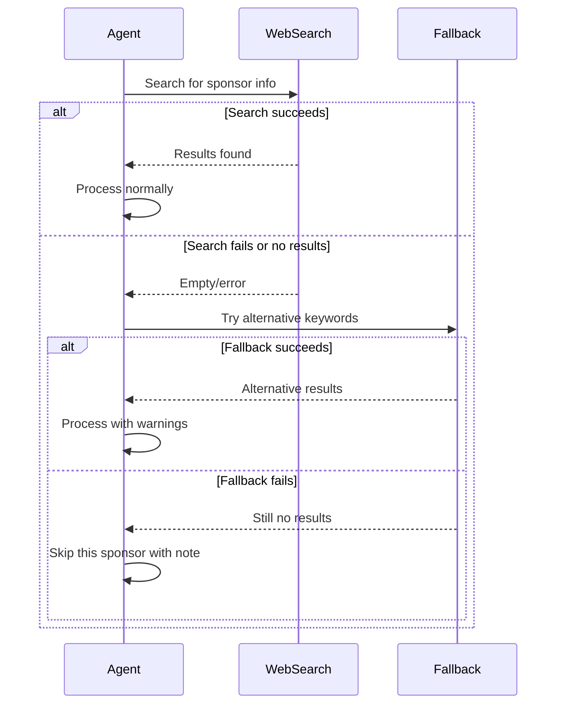

# Agent Interaction Sequence Diagram

This diagram shows the detailed interaction between agents, tools, and data throughout a sponsor search.

## Interaction Patterns

### Agent Invocation
- **Trigger**: Claude Code's Task tool with agent name
- **Input**: Structured prompt + previous phase output
- **Output**: JSON data passed to next phase

### Tool Usage by Phase

**Phase 1 (Keyword Extractor)**
- Read: Access CSOAF mission context from CLAUDE.md
- WebSearch: Optional - research unfamiliar terms

**Phase 2 (Web Researcher)**
- WebSearch: Primary - find sponsor prospects
- WebFetch: Primary - crawl sponsor websites for details

**Phase 3 (Categorizer)**
- Read: Only - no external web access needed
- Analyzes in-memory data from Phase 2

**Phase 4 (Validator)**
- WebSearch: Verify recent grant activity
- WebFetch: Check website legitimacy and current status
- Read: Access validation criteria from specs

### Data Handoffs

1. **User → Phase 1**: Natural language prompt
2. **Phase 1 → Phase 2**: Structured keywords JSON
3. **Phase 2 → Phase 3**: Raw sponsor array (unorganized)
4. **Phase 3 → Phase 4**: Categorized sponsor object
5. **Phase 4 → Output**: Validated + ranked sponsor list
6. **Output → File System**: Multiple format exports

### Error Handling

## Timing Expectations

| Phase | Agent | Expected Duration | Rate Limiting Factor |
|-------|-------|-------------------|---------------------|
| 1 | Keyword Extractor | 10-20 seconds | Model processing |
| 2 | Web Researcher | 2-4 minutes | Web searches + fetches (15-25 sites) |
| 3 | Categorizer | 20-40 seconds | In-memory analysis only |
| 4 | Validator | 2-3 minutes | Web verification (20+ sites) |
| **Total** | **All phases** | **5-7 minutes** | **Web I/O bound** |

## Parallelization Opportunities

- Phase 2: Can parallelize multiple web searches
- Phase 4: Can parallelize sponsor validation checks
- Output: Can write multiple file formats simultaneously
