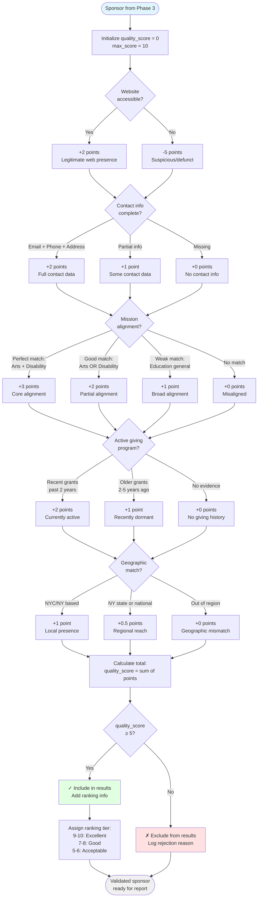
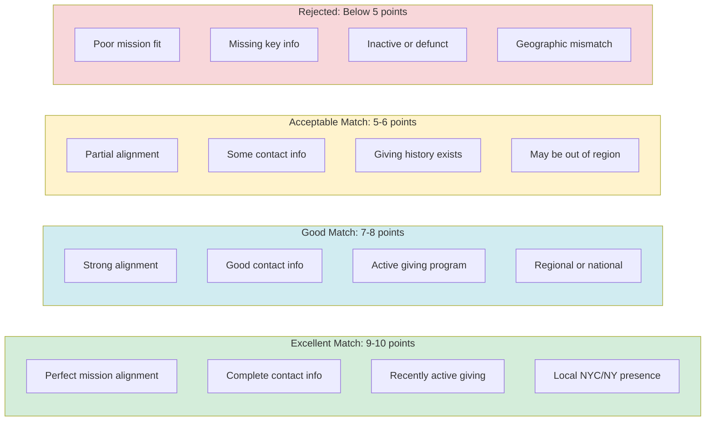

# Validation Logic Flowchart

This diagram details the validation scoring logic used in Phase 4 to ensure sponsor quality.



## Scoring Criteria Details

### 1. Website Accessibility (Max: +2)
**Test**: Attempt to fetch sponsor's primary website
- **+2**: Website loads successfully, recent content
- **0**: Website loads but outdated (>2 years old)
- **-5**: Website unreachable, DNS fails, or 404

**Why it matters**: Defunct websites indicate inactive organizations

### 2. Contact Information (Max: +2)
**Test**: Verify presence of contact methods
- **+2**: Email + Phone + Physical address
- **+1**: Email + One other method
- **0**: Email only or partial info
- **-1**: No contact info found

**Why it matters**: Outreach requires reliable contact methods

### 3. Mission Alignment (Max: +3)
**Test**: Analyze mission statement against CSOAF focus areas

**Arts Education + Disability Services (Perfect Match)**
- **+3**: Explicitly mentions both focus areas
- Examples: "Arts education for special needs students", "Creative programs for disabled youth"

**Single Focus Area (Good Match)**
- **+2**: Strong match on arts OR disability
- Examples: "Arts education for all students", "Support for disability services"

**General Education (Weak Match)**
- **+1**: General education funding, no specific focus
- Examples: "K-12 education support", "Youth development programs"

**No Match**
- **0**: Mission unrelated to CSOAF focus
- Examples: "Environmental conservation", "Healthcare research"

**Why it matters**: Mission alignment predicts grant success rate

### 4. Active Giving Program (Max: +2)
**Test**: Search for evidence of recent grant distributions

**Verification Methods**:
- Check IRS Form 990 filings (foundations)
- Search for grant announcements/press releases
- Review "Recent Grants" or "Portfolio" pages on website
- Look for grantee testimonials

**Scoring**:
- **+2**: Grants awarded in past 2 years (actively giving)
- **+1**: Grants awarded 2-5 years ago (recently dormant)
- **0**: No evidence of grants or 5+ years old
- **-2**: Explicitly closed to new applications

**Why it matters**: Inactive funders waste outreach effort

### 5. Geographic Relevance (Max: +1)
**Test**: Compare sponsor location/focus to CSOAF service areas

**Scoring**:
- **+1**: Based in NYC or NY state
- **+0.5**: National funder or NY regional coverage
- **0**: Out-of-region but considers national applications
- **-0.5**: Explicitly restricted to other regions only

**Why it matters**: Local funders have higher success rates

## Quality Score Interpretation



## Special Cases

### Foundation vs. Corporate Scoring
**Foundations**: Emphasize giving program activity (+2 critical)
**Corporations**: CSR programs may be less formal (relax giving criteria slightly)

### Government Grants
**Different criteria**:
- Website accessibility less important (government sites often outdated)
- Application cycles more important than "active giving"
- Geographic restriction is strict (NYC/NY only for municipal/state)

### Individual Donors
**Rare category**:
- Contact info verification impossible (privacy)
- Mission alignment based on public statements/interviews
- Giving history hard to verify (no 990 forms)
- Typically excluded unless extremely high-profile patron

## Validation Output Example

```json
{
  "name": "New York Foundation for the Arts",
  "quality_score": 9,
  "validation_details": {
    "website_check": {"status": "pass", "points": 2},
    "contact_info": {"status": "complete", "points": 2},
    "mission_alignment": {"status": "perfect_match", "points": 3},
    "giving_program": {"status": "active", "points": 2},
    "geographic_match": {"status": "local", "points": 1}
  },
  "ranking_tier": "Excellent",
  "recommendation": "Top priority for outreach",
  "validation_date": "2026-01-13"
}
```
