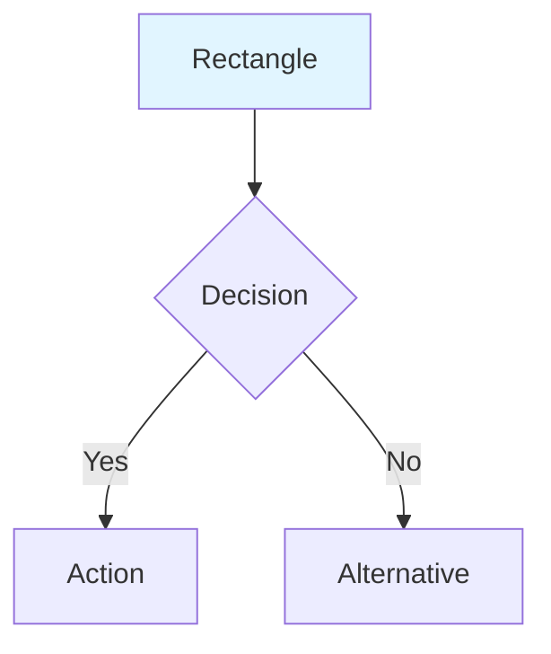
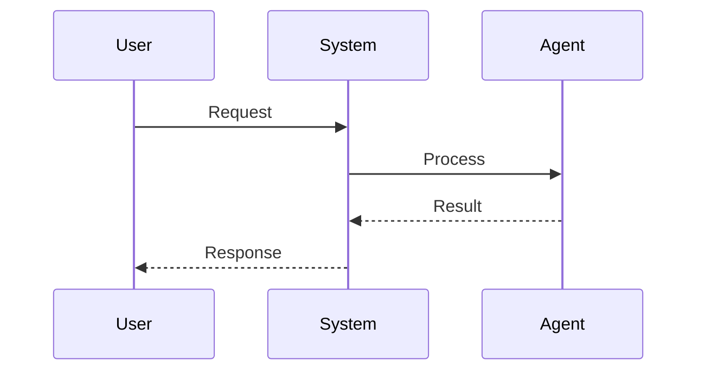
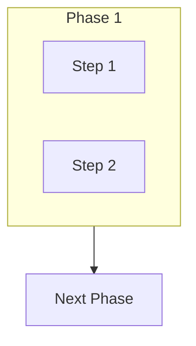

# Sponsor-Finder System Diagrams

This directory contains visual documentation of the sponsor-finder system's architecture, workflows, and logic.

## Diagram Index

### 01-system-architecture.md
**Overview**: High-level view of the 4-phase agent workflow
- Shows all agents and their connections
- Illustrates data flow between phases
- Identifies model choices (Haiku vs. Sonnet)
- Output format generation

**Best for**: Understanding the overall system design

### 02-data-flow.md
**Overview**: Detailed data transformation at each phase
- Shows how data structures evolve
- Documents input/output formats
- Explains transformation logic
- Tracks data enrichment through pipeline

**Best for**: Understanding data schemas and transformations

### 03-user-scenarios.md
**Overview**: User journey flowcharts
- Basic search flow
- Iterative refinement process
- Category-specific searches
- Multi-program campaigns

**Best for**: Understanding user interactions and use cases

### 04-agent-sequence.md
**Overview**: Detailed agent interaction sequence
- Shows tool usage patterns
- Documents timing and performance
- Illustrates error handling
- Parallelization opportunities

**Best for**: Understanding agent orchestration and timing

### 05-validation-logic.md
**Overview**: Quality validation scoring system
- Detailed scoring criteria (0-10 scale)
- Decision flowchart for inclusion/exclusion
- Special cases by sponsor type
- Quality tier definitions

**Best for**: Understanding validation algorithm and quality standards

## Diagram Format

All diagrams use **Mermaid** syntax, which is:
- Plain text (easy to version control)
- Renderable in GitHub, VS Code, and many markdown viewers
- Convertible to images using Mermaid CLI or online tools

## Viewing the Diagrams

### In GitHub
- GitHub natively renders Mermaid diagrams in markdown files
- Simply view the files in your browser
- Diagrams appear as visual flowcharts automatically

### In VS Code
1. Install "Markdown Preview Mermaid Support" extension
2. Open any diagram file
3. Use preview pane (Ctrl+Shift+V or Cmd+Shift+V)
4. Diagrams render inline with the markdown

### Online
- Copy diagram code to https://mermaid.live for interactive editing
- Export as PNG/SVG for presentations
- Share live URL for collaboration

### CLI Export (Optional)
```bash
# Install Mermaid CLI
npm install -g @mermaid-js/mermaid-cli

# Convert to PNG
mmdc -i 01-system-architecture.md -o architecture.png

# Convert to SVG
mmdc -i 02-data-flow.md -o data-flow.svg

# Convert all diagrams
mmdc -i 01-system-architecture.md 02-data-flow.md 03-user-scenarios.md 04-agent-sequence.md 05-validation-logic.md
```

## Diagram Maintenance

### When to Update

**01-system-architecture.md**: Update when adding/removing agents or phases
**02-data-flow.md**: Update when data schemas change
**03-user-scenarios.md**: Update when new use cases emerge
**04-agent-sequence.md**: Update when agent interactions change
**05-validation-logic.md**: Update when scoring criteria are modified

### How to Edit

1. Read the existing diagram file
2. Modify the Mermaid syntax within the code blocks
3. Preview changes before committing (GitHub or VS Code)
4. Update this README if adding new diagrams

## Quick Reference

### Common Mermaid Syntax

**Flowchart:**


**Sequence Diagram:**


**Subgraphs (for grouping):**


## Exporting for Documentation

### For Presentations
Generate high-quality images:
```bash
mmdc -i 01-system-architecture.md -o architecture.png -w 1920 -H 1080
```

### For README Files
Reference diagrams directly (GitHub will render them):
```markdown
See [System Architecture](diagrams/01-system-architecture.md)
```

### For Web Documentation
Use Mermaid Live server with encoded URLs:
```markdown

```

## Troubleshooting

### Diagram not rendering in VS Code
- Ensure "Markdown Preview Mermaid Support" extension is installed
- Restart VS Code after installing extension
- Check that diagram is inside a code block with ```mermaid

### Diagram not rendering on GitHub
- GitHub supports Mermaid natively, no setup needed
- Ensure syntax is correct (test on mermaid.live first)
- Check that code block is properly formatted

### Syntax errors
- Validate syntax at https://mermaid.live
- Common issues: missing semicolons, unmatched brackets, incorrect arrow syntax
- Check spaces around operators (A --> B not A-->B)

### Export issues (mmdc CLI)
- Install Puppeteer dependencies if images fail to generate
- Use Docker alternative: `docker run --rm -u $(id -u):$(id -g) -v $(pwd):/data minlag/mermaid-cli`
- Ensure output directory exists before exporting

## Related Documentation

- **System Spec**: `specs/sponsor-finder-spec.md` - Detailed requirements
- **Project Guide**: `CLAUDE.md` - Claude Code instructions
- **Agent Definitions**: `.claude/agents/*.md` - Individual agent roles
- **Planning Docs**: `.claude/PLAN_*.md` - Feature implementation plans

## Contributing

When adding new diagrams:
1. Follow the naming convention: `##-descriptive-name.md`
2. Include a title and description at the top
3. Add color coding for clarity (style directives)
4. Update this README with the new diagram
5. Test rendering on GitHub/VS Code before committing
6. Consider adding a "Why this diagram?" section

## Why Mermaid?

We use Mermaid because it:
- **Renders natively** in GitHub (no extra setup)
- **Version control friendly** (plain text, easy diffs)
- **Low barrier to entry** (simple syntax, great docs)
- **Widely supported** (VS Code, GitLab, Notion, Confluence)
- **Exportable** (CLI tool for PNG/SVG generation)
- **Interactive** (mermaid.live for editing and sharing)
